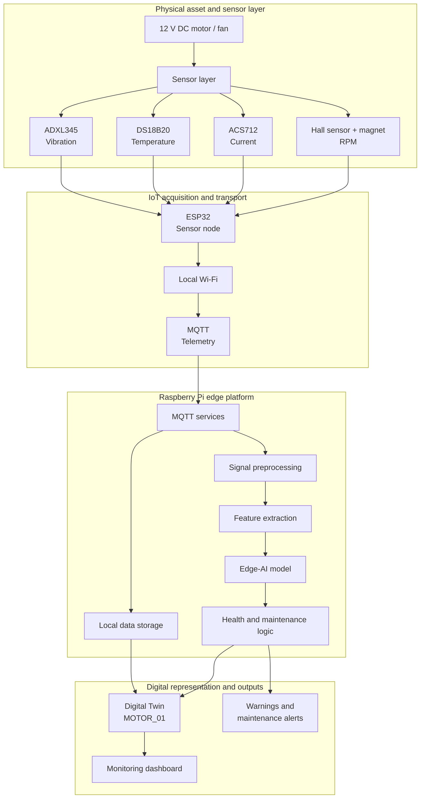
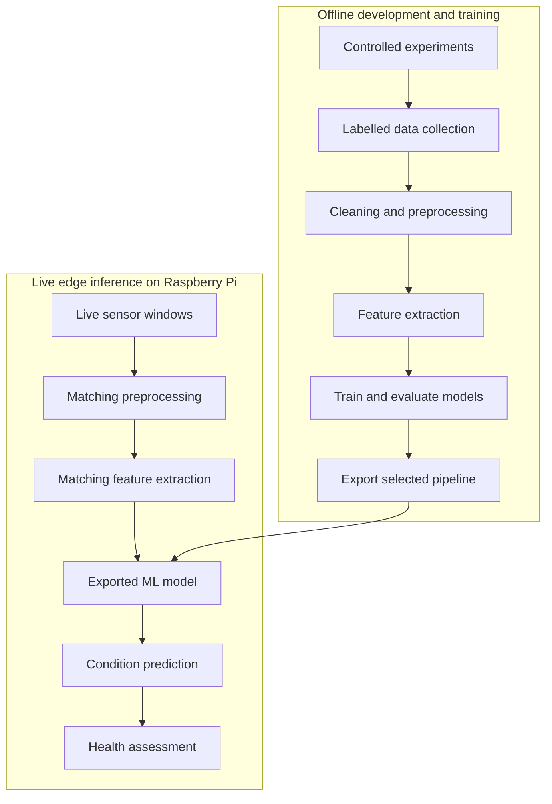

<div align="center">

# Edge-AI Digital Twin for Predictive Maintenance

### From multi-sensor telemetry to local machine-health decisions at the edge

A five-member academic engineering project developing a real-time condition-monitoring prototype for a DC motor/fan using IoT sensing, Edge AI, and a synchronized Digital Twin.

[](#development-status)
[](#technology-stack)
[](#hardware)
[](#hardware)
[](#communication-design)
[](#machine-learning-pipeline)

</div>

> [!IMPORTANT]
> This project is **currently under development**. The system architecture, hardware selection, software approach, and initial AI strategy have been planned. Hardware integration, dataset collection, model training, edge deployment, Digital Twin implementation, dashboard development, and experimental validation are planned work—not completed results.

## Table of Contents

- [Project Overview](#project-overview)
- [Project Documentation](#project-documentation)
- [Planned Capabilities](#planned-capabilities)
- [Version 1 Scope](#version-1-scope)
- [System Architecture](#system-architecture)
- [Hardware](#hardware)
- [Technology Stack](#technology-stack)
- [Communication Design](#communication-design)
- [Why Edge AI?](#why-edge-ai)
- [Machine-Learning Pipeline](#machine-learning-pipeline)
- [Dataset and Evaluation Protocol](#dataset-and-evaluation-protocol)
- [Digital Twin](#digital-twin)
- [Experimental Conditions](#experimental-conditions)
- [Repository Structure](#repository-structure)
- [Development Status](#development-status)
- [Implementation Roadmap](#implementation-roadmap)
- [Scope Boundaries](#scope-boundaries)
- [Safety](#safety)
- [Team Collaboration](#team-collaboration)
- [Future Results](#future-results)
- [Success Criterion](#success-criterion)

## Project Overview

Industrial maintenance is commonly **reactive** (repair after failure) or **preventive** (service on a fixed schedule). Reactive maintenance risks unplanned downtime, while preventive maintenance can replace or service components that are still healthy. **Predictive maintenance** instead uses condition data to identify developing abnormalities and support maintenance decisions before major failure.

This project proposes a compact predictive-maintenance testbed built around a **12 V DC motor/fan**, representing a small rotating machine. Four sensor types will measure vibration, temperature, electrical current, and rotational speed. An **ESP32** will acquire the measurements and publish telemetry over local Wi-Fi using **MQTT**. A **Raspberry Pi** will receive and store the data, preprocess signals, extract features, run a trained machine-learning model locally, maintain the Digital Twin state, and support dashboard and alert services.

The project integrates four distinct layers:

| Layer | Purpose |
|---|---|
| **IoT sensing** | Acquire and transport physical measurements from the motor/fan |
| **Edge AI** | Run low-latency machine-condition inference locally on the Raspberry Pi |
| **Digital Twin** | Maintain a continuously updated software representation of the physical asset |
| **Predictive-maintenance logic** | Convert measurements and predictions into health states, warnings, and maintenance recommendations |

**Core flow**

`Physical motor/fan → Sensors → ESP32 → Wi-Fi/MQTT → Raspberry Pi → Preprocessing → Feature extraction → Edge-AI inference → Health logic → Digital Twin → Dashboard/alerts`

## Project Documentation

- [Architecture](docs/ARCHITECTURE.md) — component responsibilities, data flow, deployment boundaries, and system invariants
- [Architecture Decisions](docs/DECISIONS.md) — accepted scope and design choices that should not drift without team review
- [MQTT Contract](docs/MQTT_CONTRACT.md) — proposed topics, payload envelopes, ownership, QoS, and reconnect behaviour
- [Data-Collection Protocol](docs/DATA_COLLECTION_PROTOCOL.md) — repeatable runs, labels, metadata, storage, and leakage-safe splitting
- [Test Plan](docs/TEST_PLAN.md) — sensor, IoT, ML, Digital Twin, dashboard, latency, and end-to-end validation
- [Eight-Week Roadmap](docs/ROADMAP.md) — weekly deliverables, exit criteria, dependencies, and definition of done
- [Safety Plan](docs/SAFETY.md) — electrical, mechanical, thermal, experimental, and emergency controls

Module-specific guidance is available in the `esp32`, `raspberry-pi`, `ai`, `digital-twin`, `dashboard`, `data`, and `tests` directories. These files describe the agreed interfaces and implementation order; they do not claim that the corresponding software has already been completed.

## Planned Capabilities

The completed prototype is intended to provide:

- Multi-sensor monitoring of vibration, temperature, current, and RPM
- ESP32-based sensor acquisition and telemetry packaging
- Lightweight publish/subscribe communication using MQTT
- Local preprocessing and feature extraction on the Raspberry Pi
- Edge-AI classification of controlled operating conditions
- Machine-health assessment and alert logic
- Synchronized Digital Twin state for the physical motor/fan
- Live readings, historical trends, predictions, and alerts on a dashboard
- Maintenance recommendations based on the inferred machine state

## Version 1 Scope

The team will first build the **smallest complete end-to-end system** before expanding the number of sensors, fault classes, or visual features.

| Stage | Sensors and classes | Required outcome |
|---|---|---|
| **Core MVP** | Vibration (ADXL345) + current (ACS712); `Normal` versus `Abnormal` | Stable motor-to-dashboard pipeline, labelled data capture, baseline Random Forest inference, and automatic Digital Twin state updates |
| **Complete prototype** | Add temperature (DS18B20) and RPM (Hall sensor); `Normal`, `Controlled imbalance`, `Increased load / overload`, and `Thermal abnormality` | Synchronized multi-sensor monitoring, validated multi-class inference, health states, trends, alerts, and maintenance messages |
| **Optional enhancement** | Advanced models, 3D visualization, or public-dataset RUL demonstration | Attempted only after the complete prototype is reliable and validated |

Where practical, RPM should be recorded from the beginning because speed changes can alter vibration and current independently of a fault. However, RPM is not required to block the first vibration-and-current pipeline test.

## System Architecture



### Responsibility Boundary

| Device | Primary responsibility |
|---|---|
| **ESP32** | Sensor acquisition, basic validation/timestamping, telemetry packaging, Wi-Fi connection, and MQTT publishing |
| **Raspberry Pi** | MQTT services, local storage, preprocessing, feature extraction, live inference, health logic, Digital Twin backend, dashboard services, and alerts |
| **Development laptop** | Dataset exploration, model training and evaluation, and export of the selected model |

## Hardware

| Component | Function | Role in the system |
|---|---|---|
| **12 V DC motor/fan assembly** | Provides a controlled rotating-machine test platform | Physical asset represented by the Digital Twin |
| **ADXL345 accelerometer** | Measures three-axis acceleration | Captures vibration patterns associated with normal and imbalanced operation |
| **DS18B20 temperature sensor** | Measures motor-casing temperature | Tracks thermal behaviour and controlled temperature abnormalities |
| **ACS712 current sensor** | Measures motor supply current | Indicates changes in electrical demand, including increased load |
| **Hall-effect sensor + magnet** | Produces rotational pulses | Enables RPM calculation and speed-trend monitoring |
| **ESP32 development board** | Reads sensors and publishes telemetry | IoT sensor-acquisition node |
| **Raspberry Pi** | Performs local processing and hosts edge services | Edge computer for inference, storage, health logic, Digital Twin, and dashboard services |
| **Regulated power supply and protection** | Powers the motor and electronics within rated limits | Supports safe and repeatable experiments |

> Exact component ratings, wiring, sampling rates, and sensor calibration procedures will be documented after prototype integration and validation.

## Technology Stack

The initial stack has been selected at a technology-family level. Options marked **candidate** will be evaluated during implementation rather than treated as final decisions.

| Layer | Planned technologies | Purpose / status |
|---|---|---|
| **Embedded / IoT** | ESP32, Arduino IDE or PlatformIO, Wi-Fi, MQTT | Sensor interfacing and telemetry; IDE/toolchain to be finalized |
| **Edge platform** | Raspberry Pi, Raspberry Pi OS, Python, Mosquitto, Paho MQTT | Local MQTT, processing, inference, and application services |
| **Data processing** | NumPy, Pandas, SciPy | Signal windows, cleaning, transformation, and feature extraction |
| **Machine learning** | scikit-learn, Random Forest, Gradient Boosting, Joblib | Initial model training, comparison, serialization, and deployment |
| **Storage** | CSV initially; SQLite or InfluxDB if required | Begin with the simplest reproducible storage approach and expand only when justified |
| **Dashboard / Digital Twin** | Streamlit or Node-RED; Grafana optional | Candidate options for visualization and operator interaction |
| **Future model runtimes** | TensorFlow Lite or ONNX Runtime | Optional evaluation only if later models require them |

Cloud services are not required for the core design: the proposed monitoring and inference path is local to the ESP32–Raspberry Pi system.

## Communication Design

The proposed communication layer uses **MQTT over local Wi-Fi**. The ESP32 will publish sensor telemetry, while Raspberry Pi services will subscribe to the required topics. MQTT is suitable for the prototype because it is lightweight, decouples publishers from subscribers, and maps naturally to IoT telemetry.

Proposed topic hierarchy:

```text
motor01/
├── vibration
├── temperature
├── current
├── rpm
├── status
├── health
└── alerts
```

The final message schema, Quality of Service level, publishing frequency, timestamps, units, and reconnection behaviour will be defined and tested during implementation.

## Why Edge AI?

The project qualifies as **Edge AI** because live machine-learning inference is planned to run on the **Raspberry Pi beside the monitored equipment**, rather than depending on a remote cloud service. This can provide faster local decisions, continued operation without internet access, lower external data-transfer requirements, and improved control over machine data.

Edge AI does **not** require the model to be trained on the edge device. This project separates the two stages:

| Stage | Planned location | Description |
|---|---|---|
| **Model training** | Development laptop | Use labelled experimental data to train, compare, and evaluate candidate models |
| **Live model inference** | Raspberry Pi | Apply the exported preprocessing pipeline and trained model to incoming sensor windows in real time |

The ESP32 remains focused on acquisition and communication; the more computationally intensive signal processing and inference will occur on the Raspberry Pi.

## Machine-Learning Pipeline



### Initial Model Candidates

- **Random Forest** — a robust baseline for mixed sensor features and nonlinear relationships
- **Gradient Boosting** — a second tree-based approach for performance comparison

A more complex model, such as a 1D convolutional neural network, would be considered only if the collected data and baseline results justify the additional complexity.

### Planned Feature Set

Vibration data will be processed in time windows rather than treated as isolated samples. Candidate vibration features include:

| Time-domain features | Frequency-domain features |
|---|---|
| Root mean square (RMS) | Dominant frequency |
| Mean and mean absolute value | FFT-band energy |
| Standard deviation | Additional spectral features if supported by the data |
| Peak and peak-to-peak amplitude |  |
| Kurtosis and crest factor |  |

These vibration features can be combined with synchronized **temperature**, **current**, and **RPM** measurements to form the model input vector. The final feature set will be selected through experimental analysis and validation.

To prevent training–deployment mismatch, the same preprocessing and feature definitions used during training will be exported or reproduced on the Raspberry Pi.

## Dataset and Evaluation Protocol

The team will collect its own labelled data through **multiple repeated experimental runs**, rather than treating one long recording as the complete dataset. Each run should retain at least:

- Timestamp and run/session ID
- Operating class and the method used to create it
- Motor speed or PWM setting
- Applied load or imbalance configuration
- Sensor sampling settings, units, and calibration notes
- Relevant environmental or hardware changes

> [!WARNING]
> Training, validation, and test data must be split by **complete experimental runs or sessions**. Randomly distributing adjacent windows from the same recording across training and test sets can leak highly similar samples and produce unrealistically high accuracy.

Evaluation will include **accuracy, macro-F1, per-class precision and recall, confusion matrix, false-alarm behaviour, inference latency, sensor-to-dashboard latency, and Digital Twin state accuracy**. Model performance will be reported together with the data-splitting method and class distribution.

## Digital Twin

The Digital Twin will be a **stateful software representation** of the physical motor/fan—not merely a dashboard. The dashboard will visualize information; the Digital Twin backend will maintain the identity, current state, inferred condition, alert state, and history of the asset.

**Synchronization principle**

`Physical condition changes → Sensor measurements change → Edge services process the data → MOTOR_01 state updates → Dashboard and alerts reflect the new state`

Illustrative state schema (runtime values intentionally left unset):

```json
{
  "asset_id": "MOTOR_01",
  "telemetry": {
    "vibration": null,
    "temperature": null,
    "current": null,
    "rpm": null
  },
  "predicted_state": null,
  "anomaly_probability": null,
  "health_score": null,
  "alert_state": null,
  "historical_data_reference": null,
  "last_updated": null
}
```

The final implementation is planned to expose live telemetry, historical plots, predicted operating class, anomaly probability (if supported by the selected model), health state, maintenance recommendation, and alert history.

### Condition and Health Views

The AI model is planned to distinguish specific experimental classes:

`Normal | Controlled imbalance | Increased load / overload | Thermal abnormality`

The operator-facing health logic may map these model outputs to a simpler presentation:

`HEALTHY → WARNING → FAULT`

The mapping rules and thresholds will be defined from collected baseline data and validated experiments; they have not yet been finalized.

## Experimental Conditions

All operating classes below are **planned controlled experiments**. Expected tendencies are engineering hypotheses to be tested—not reported results.

| Planned class | Controlled condition | Expected sensor tendency |
|---|---|---|
| **Normal** | Motor operates within its intended baseline condition | Establishes reference vibration, temperature, current, and RPM behaviour |
| **Controlled imbalance** | A small, securely attached off-centre mass is introduced behind a protective guard | Vibration is expected to increase or change in pattern |
| **Increased load / overload** | A safe, repeatable load is applied within defined electrical and mechanical limits | Current is expected to increase; RPM may decrease |
| **Thermal abnormality** | Motor temperature is raised above its normal baseline while remaining within safe rated limits | Temperature is expected to increase relative to the baseline |

Data collection will require consistent labels, timestamps, units, sampling settings, and experimental metadata so that model evaluation remains reproducible.

## Repository Structure

The repository now provides a documented scaffold for the planned implementation:

```text
edge-ai-digital-twin/
├── .github/                    # Issue and pull-request templates
├── ai/                         # Feature engineering, model training, and artifacts
├── dashboard/                  # Planned operator dashboard
├── data/                       # Dataset rules and local raw/processed folders
├── digital-twin/               # Asset-state and health-logic design
├── docs/                       # Architecture, protocols, roadmap, tests, and safety
├── esp32/                      # Sensor-node firmware guidance
├── raspberry-pi/               # Edge-service guidance
├── tests/                      # Validation strategy
├── .env.example                # Non-secret configuration template
├── .gitignore
├── requirements.txt            # Initial Python runtime dependencies
├── requirements-dev.txt        # Development and test dependencies
└── README.md
```

Implementation code will be added progressively inside these modules. Raw datasets, trained-model binaries, credentials, local databases, logs, and generated outputs are excluded from Git unless the team explicitly approves a small reproducible example.
## Development Status

### Research and Design

- [x] Select project topic and define the problem
- [x] Complete initial predictive-maintenance research
- [x] Design the high-level IoT and Edge-AI architecture
- [x] Define the Digital Twin concept
- [x] Select the primary sensors and processing hardware
- [x] Identify the initial software stack and ML approach
- [x] Document architecture decisions, MQTT contract, dataset protocol, test plan, roadmap, and safety controls

### Hardware and IoT

- [ ] Construct and guard the physical motor/fan test rig
- [ ] Integrate and calibrate the four primary sensors
- [ ] Develop ESP32 acquisition firmware
- [ ] Establish ESP32-to-Raspberry Pi MQTT communication
- [ ] Validate synchronized, timestamped sensor data flow

### Data and Machine Learning

- [ ] Define the experiment and labelling protocol
- [ ] Collect normal and controlled abnormal-condition datasets
- [ ] Implement preprocessing and feature extraction
- [ ] Train and evaluate Random Forest and Gradient Boosting models
- [ ] Select and export the best validated model pipeline

### Edge AI, Digital Twin, and Validation

- [ ] Deploy the selected model to the Raspberry Pi
- [ ] Implement continuous live inference and health logic
- [ ] Implement the `MOTOR_01` Digital Twin backend
- [ ] Develop the monitoring dashboard and alerts
- [ ] Integrate all hardware and software layers
- [ ] Validate classification, latency, resource use, and alert behaviour
- [ ] Complete the final demonstration and documentation

## Implementation Roadmap

The agreed implementation order is:

`Freeze scope and architecture → Build safe motor rig → Test sensors individually → Program ESP32 → Establish MQTT communication → Store live data → Collect normal data → Collect controlled abnormal data → Clean/window/extract features → Train and evaluate models → Deploy model on Raspberry Pi → Add health and alert logic → Build Digital Twin backend → Build dashboard → Integrate and validate`

> [!IMPORTANT]
> The earliest milestone is **physical motor → real sensor values → ESP32 → MQTT → Raspberry Pi → stored/live data**. Major AI optimization and dashboard styling should wait until this pipeline is reliable.

### Eight-Week Core Target

| Week | Primary focus | Target output |
|---:|---|---|
| **1–2** | Architecture, components, safe motor rig, and individual sensor tests | Stable physical platform and verified sensor readings |
| **3** | ESP32 sensor acquisition | Timestamped and structured telemetry from the selected sensors |
| **4** | MQTT, Raspberry Pi, and storage | Reliable live transmission and stored data |
| **5** | Normal and controlled-fault data collection | Labelled, repeatable experimental runs with metadata |
| **6** | Preprocessing, feature extraction, and model training | Evaluated baseline models with run-based splitting |
| **7** | Raspberry Pi inference and Digital Twin/dashboard | Local live classification, synchronized state, trends, and alerts |
| **8** | Integration, validation, and demonstration | Repeatable end-to-end demonstration and documented metrics |

Remaining academic time can be used for additional sensors, stronger multi-class performance, improved health scoring, visualization, extended testing, and optional advanced features.

## Scope Boundaries

- The core project is **condition monitoring, anomaly/fault classification, and maintenance warning**.
- The team will **not claim Remaining Useful Life (RUL)** from a few weeks or months of its own motor data. A separate RUL demonstration may use a suitable public run-to-failure dataset if time permits.
- The Version 1 Digital Twin does not require a 3D motor model or high-fidelity physics simulation.
- Cloud processing is not required for the core system; live inference must work locally on the Raspberry Pi.
- Health scores and maintenance messages are prototype decision-support outputs, not validated industrial safety or maintenance certification.
## Safety

Because the testbed contains electrical and rotating components, safety is a design requirement rather than a final-stage addition.

- Mount the motor securely on a stable base
- Keep motor power separate from the ESP32 and Raspberry Pi power system
- Never route motor current through a solderless breadboard
- Fit a transparent guard around all rotating components
- Secure any experimental imbalance mass against detachment
- Use fuse protection and a master/emergency power switch
- Operate within the rated voltage, current, speed, and temperature limits of every component
- Insulate and strain-relieve electrical connections
- Apply mechanical load in a controlled and repeatable manner
- Stop testing if vibration, temperature, current, noise, or mounting stability exceeds the approved limit
- Keep hands, cables, clothing, and loose objects clear of the rotating assembly

> Abnormal conditions are intended to be **controlled, non-destructive experiments**. The team will not intentionally create unsafe or destructive faults.

## Team Collaboration

The project is being developed by a **five-member academic team** in one shared GitHub repository. Work should be divided into modular branches and integrated through reviewed pull requests.

### Recommended Workflow

`Create branch → Make focused changes → Commit → Push → Open pull request → Review and test → Merge`

Example branch names:

```text
feature/esp32-sensors
feature/mqtt-communication
feature/ai-training
feature/edge-inference
feature/digital-twin
feature/dashboard
docs/project-documentation
```

Example commit messages:

```text
feat: add ADXL345 vibration acquisition
feat: implement MQTT sensor publishing
feat: add Random Forest training pipeline
fix: correct RPM calculation
docs: update architecture diagram
test: validate MQTT communication
```

Each pull request should describe the change, its test evidence, any affected interfaces or MQTT topics, and any follow-up work. Git history and pull-request reviews will provide a transparent record of individual contributions.

### Team Responsibilities and Contributors

| Team member | GitHub | Primary responsibilities |
|---|---|---|
| **Krutharth** | [`@krutharth-dev`](https://github.com/krutharth-dev) | Overall system architecture; Digital Twin design and backend; Edge-AI methodology, training and evaluation; health and alert logic; cross-module integration; technical validation and final demonstration |
| **KISHAN-B-GOWDA** | [`@KISHAN-B-GOWDA`](https://github.com/KISHAN-B-GOWDA) | Raspberry Pi setup and integration; MQTT ingestion and local storage; signal preprocessing and feature extraction; Edge-AI model deployment; Digital Twin services; integration testing and debugging |
| **kavanasomesh-spec** | [`@kavanasomesh-spec`](https://github.com/kavanasomesh-spec) | Motor power-system planning; fuse and emergency controls; physical safety; sensor wiring and mounting; calibration; controlled-condition setup and hardware test evidence |
| **manyavasu2006** | [`@manyavasu2006`](https://github.com/manyavasu2006) | ESP32 sensor acquisition; telemetry formatting; Wi-Fi and MQTT publishing; run identification; labelled data collection; data-quality checking and communication tests |
| **monishasm32-lab** | [`@monishasm32-lab`](https://github.com/monishasm32-lab) | Streamlit or Node-RED dashboard setup; live sensor cards and graphs; health, warning and alert display; CSV data review; Digital Twin UI integration; interface testing; documentation and presentation work |

#### Responsibility Overview

- **Krutharth:** Defines the overall system architecture and Digital Twin design, develops the Edge-AI training and evaluation approach, establishes health and alert logic, brings the project modules together, and coordinates technical validation and the final demonstration.
- **KISHAN-B-GOWDA:** Configures and develops the Raspberry Pi environment, implements MQTT ingestion and local storage, builds the preprocessing and feature-extraction flow, deploys the selected Edge-AI model, connects Digital Twin services, and investigates integration problems.
- **kavanasomesh-spec:** Plans and assembles the motor power system, fuse and emergency controls, applies the physical safety requirements, mounts and wires the sensors, performs calibration, prepares controlled operating conditions, and records hardware test evidence.
- **manyavasu2006:** Develops ESP32 sensor acquisition, structures telemetry with timestamps and run identification, implements Wi-Fi and MQTT publishing, participates in labelled data collection, checks data quality, and tests communication behaviour.
- **monishasm32-lab:** Creates the Streamlit or Node-RED dashboard, presents live readings and historical graphs, displays health and alert states, reviews CSV outputs, connects the Digital Twin state to the interface, performs interface testing, and documents the dashboard and presentation workflow.

Responsibilities identify the team's current areas of ownership without ranking their importance or difficulty. Members may collaborate across modules as needed. Each member should use their own branches, commits and pull requests so the repository accurately records their contributions.

## Future Results

No experimental results are reported yet. After implementation and validation, this section will be updated with measured evidence rather than estimated or fabricated values.

| Evaluation area | Future additions |
|---|---|
| **Classification** | Accuracy, precision, recall, F1 score, confusion matrix, and model comparison |
| **Sensor analysis** | Time-series plots, class comparisons, feature distributions, and frequency analysis |
| **Edge performance** | Inference latency, processing time, MQTT behaviour, CPU/memory use, and storage requirements |
| **System behaviour** | Digital Twin synchronization, alert validation, and end-to-end response observations |
| **Visual evidence** | Prototype photographs, wiring diagram, dashboard screenshots, and Digital Twin views |
| **Demonstration** | GIF or video of controlled condition changes and system response |

Results will also document the dataset protocol, train/validation/test strategy, limitations, failure cases, and reproducibility details.

## Success Criterion

The primary end-to-end demonstration goal is:

> **Change the physical motor condition → observe a measurable sensor response → detect the condition locally with Edge AI → update the Digital Twin → generate an appropriate health state or maintenance warning.**

The target demonstration sequence is:

`Normal operation → Live readings → HEALTHY classification → Introduce a safe controlled abnormal condition → Sensor response changes → Edge AI detects the condition → Digital Twin changes automatically → Warning appears → Remove abnormal condition → System returns to normal`

A successful implementation will demonstrate the disciplined integration of **IoT sensing, sensor fusion, Edge AI, predictive-maintenance logic, and Digital Twin technology** in one functioning academic prototype.

---

<div align="center">

**Academic engineering project · Five-member team · Currently under active development**

</div>
